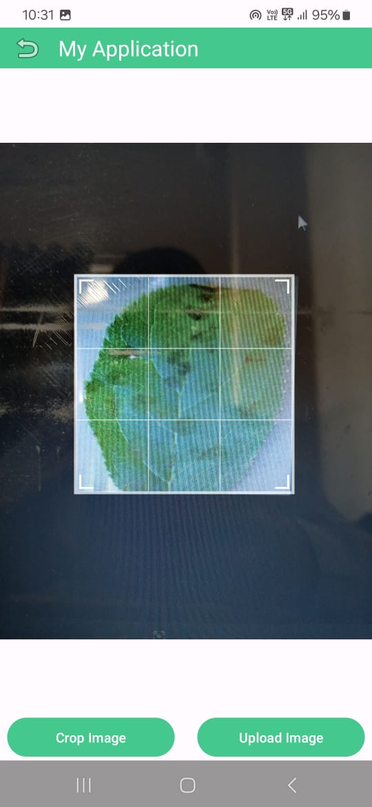
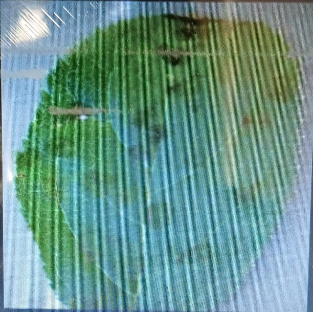
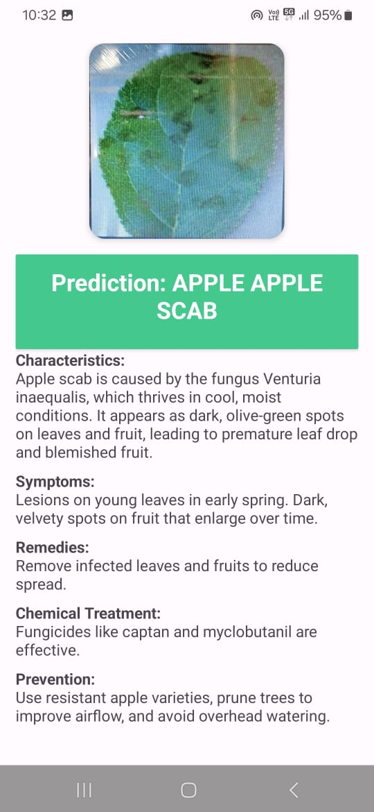
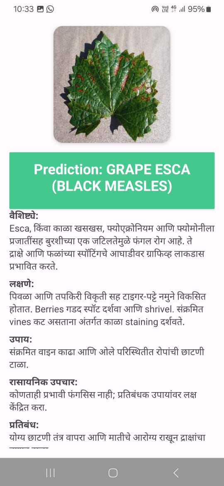

# 🌾 Multiclass Crop Disease Prediction App

A mobile application that identifies plant diseases from leaf images using a deep learning model trained on multiple crop classes. This tool aids farmers and agricultural professionals by providing instant disease detection to support timely intervention and treatment.

---

## 📱 Features

- 🔍 Detects multiple crop diseases from leaf images
- 🧠 Uses a lightweight deep learning model (SqueezeNet)
- 📤 Upload or capture leaf image via camera
- 🌐 Sends image to backend server for prediction
- 📊 Displays prediction result with disease name and confidence
- 🌍 Supports multiple languages (e.g., English, Marathi)

---

## 🧠 Model

- Architecture: **SqueezeNet**
- Framework: **PyTorch**
- Input Size: `128x128`
- Classes: `Healthy`, `Late Blight`, `[other classes if any]`
- Training Dataset: Custom image dataset organized into subfolders for each class

---

## 📸 Here are the screenshots of app
<h3>📸 Screenshots</h3>

  
  
  
  
  
  
  
  
  

https://github.com/user-attachments/assets/4e1407f2-041e-4fd6-a157-3f9c0bd60d49

